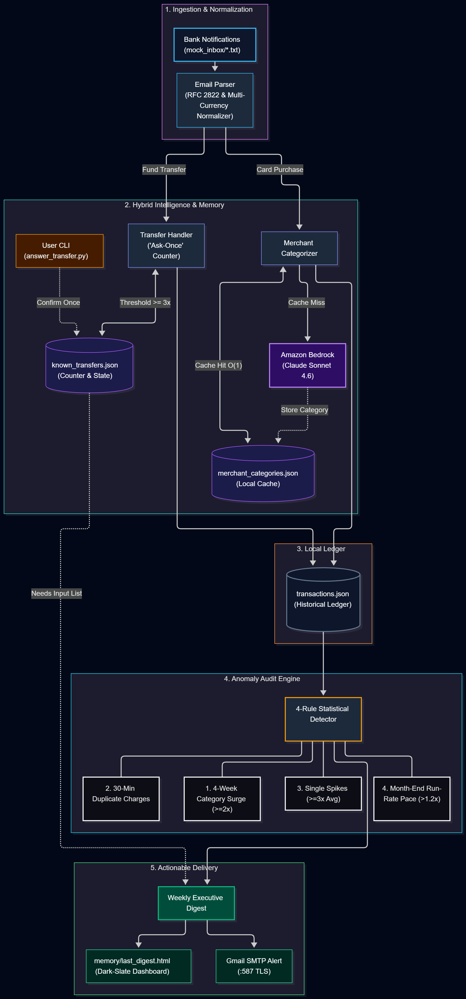
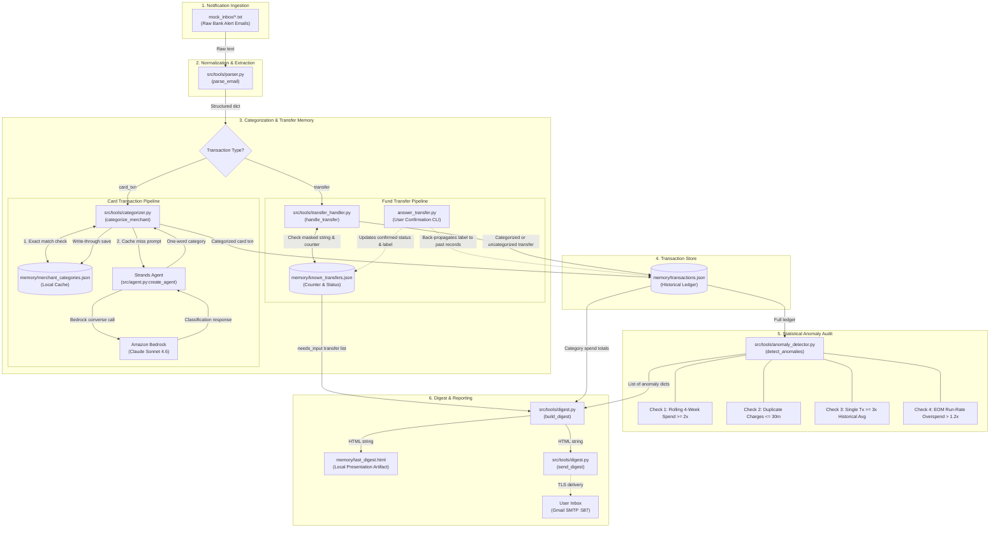

# PocketSense Technical Architecture

> Architectural specification and data flow documentation for PocketSense, an autonomous financial intelligence agent built with the **Strands Agents SDK** and **Amazon Bedrock**.

---

## 1. System Overview & Core Principles

PocketSense is built on four fundamental architectural principles:

1. **Deterministic Core Pipeline ("Silent Background Agent")**: Transaction ingestion, parsing, duplicate checking, and anomaly audits run as a predictable, testable, deterministic pipeline. The LLM is used precisely where semantic classification is required, avoiding non-deterministic tool-loop regressions during critical financial accounting.
2. **Privacy-First Zero-Database Architecture**: All state is persisted in local, structured JSON files inside `/memory`. No external databases, no third-party credential storage, and no cloud data leakage.
3. **Write-Through Semantic Memory Caching**: LLM classifications for merchants are stored in `memory/merchant_categories.json`. Repeating merchants hit memory in constant time $O(1)$, minimizing Bedrock token consumption and latency.
4. **Human-in-the-Loop "Ask Once" Workflow**: Bank-masked fund transfers (`A*** K***`) are not guessed. They accumulate frequency counters in `memory/known_transfers.json`. When observed $\ge 3$ times, the agent requests user input via weekly digests and updates historical and future records upon single confirmation via CLI.

---

## 2. End-to-End Data Flow Architecture

  

The sequence and component architecture below illustrates the complete lifecycle of a bank notification through PocketSense:

---

## 3. Model Provider: Amazon Bedrock

PocketSense integrates with **Amazon Bedrock** as its core generative intelligence provider, managed through the **Strands Agents SDK**:

- **Strands Agent Integration**: All LLM interactions are orchestrated through the Strands `Agent` abstraction instantiated via `src/agent.py:create_agent()` using `BedrockModel` rather than low-level `boto3` client invocations. `src/tools/categorizer.py` routes semantic classification prompts directly through this agent.
- **Model Identifier**: `us.anthropic.claude-sonnet-4-6` (Anthropic Claude Sonnet 4.6).
- **Inference Profile**: Uses Bedrock's regional inference profile routing (`us.` prefix in `us-east-1`), ensuring low latency and on-demand access compliance.
- **Credential Provider**: Resolves AWS credentials via standard environment and AWS credential chains (`AWS_ACCESS_KEY_ID`, `AWS_SECRET_ACCESS_KEY`, `AWS_REGION` from `.env`).
- **Inference Configuration**:
  - `temperature`: `0.0` (maximally deterministic classification).
  - `max_tokens`: `256` (enforces concise, deterministic responses while preventing loop truncation exceptions).
- **Graceful Fault Tolerance**: If Bedrock access is ungranted or verification is in progress, the categorizer catches `ValidationException`, `AccessDeniedException`, or marketplace access restrictions, prints an informative console diagnostic, and defaults to category `"Other"` without hanging or retrying in an infinite loop.

---

## 4. Component Breakdown & Strands Tools

### `src/tools/parser.py` (`@tool parse_email`)
- Normalizes RFC 2822 dates to ISO-8601 strings.
- Strips multi-currency identifiers (`Rs`, `PKR`, `₨`) and comma thousand-separators into pure floats.
- Automatically flags counterparty privacy masking (`is_masked: True` if recipient contains `*`).

### `src/tools/categorizer.py` (`@tool categorize_merchant`)
- Evaluates merchants against allowed categories: `Food & Dining`, `Utilities`, `Transport`, `Shopping`, `Entertainment`, `Health`, `Rent`, `Transfers`, `Other`.
- Checks `memory/merchant_categories.json` first (case-insensitive).
- On cache miss, queries Bedrock via the Strands `Agent` (`src/agent.py:create_agent()`) and updates cache file.

### `src/tools/transfer_handler.py` (`@tool handle_transfer`)
- Unmasked transfers are routed directly through `categorize_merchant`.
- Masked transfers check `memory/known_transfers.json`:
  - If status is `confirmed`, returns remembered category.
  - If unconfirmed, increments occurrence counter. When `count >= 3`, promotes status to `needs_input`.
  - Always returns `"Transfers (uncategorized)"` until explicitly confirmed by the user.

### `src/tools/anomaly_detector.py` (`@tool detect_anomalies`)
- **Category Run-Rate**: Compares current 7-day spend against trailing 4-week average ($2\times$ threshold).
- **Duplicate Charges**: Flags matching merchant and amount within 30 minutes; exempts repeat-visit merchants (coffee shops, cafes, bakeries) with distinct same-day timestamps.
- **Single Outliers**: Identifies charges $\ge 3\times$ historical merchant or category average.
- **Month-End Pace**: Projects monthly spend against the prior 2 full calendar months ($>1.2\times$ threshold).
- **Refund Netting**: Net-subtracts reversals and refunds from category spend rather than flagging them as separate anomalies.

### `src/tools/digest.py` (`@tool build_digest` & `@tool send_digest`)
- Builds an executive, dark-slate responsive HTML email.
- Displays net spend, category distribution bar charts, anomaly cards with severity badges, and CLI command instructions for pending transfers.
- Preserves `memory/last_digest.html` on disk before initiating Gmail SMTP (`smtp.gmail.com:587`).

---

## 5. Security & Privacy

1. **Zero Raw Email Retention in Cloud**: Raw emails remain on the local filesystem in `/mock_inbox`.
2. **Minimal Prompt Payloads**: Only the merchant string is passed to the LLM (e.g. *"What spending category does Foodpanda belong to?"*). Account numbers, balances, and recipient names are never transmitted to the model provider.
3. **No External SaaS Dependencies**: All ledger calculations, metrics, and anomaly checks run locally in native Python.
